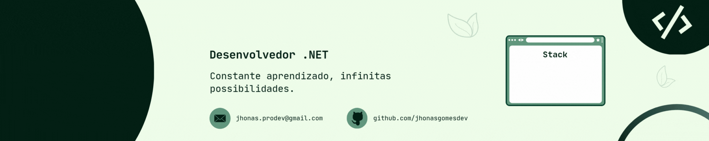

  

  

##

  Estudante de Sistemas de Informação no Centro Universitário La Salle – RJ e desenvolvedor júnior focado em .NET.
  Tenho experiência com C#, ASP.NET Core, Entity Framework e bancos de dados relacionais.
  Busco constantemente aprimorar meus conhecimentos e enfrentar novos desafios na área de tecnologia, aplicando soluções eficientes e de qualidade.

##

<table align="center">
  <tr>
    <!-- Coluna esquerda: Redes + Stack -->
    <td align="center" width="60%">
      <h3>Connect with me!</h3>
      
      
      
      <h3>My Stack ~</h3>
      <!-- Tech stack icons -->
      
      
      
      
      
      
      
    </td>
    <!-- Coluna direita: Imagem pixel art -->
    <td align="center" width="40%">
      
    </td>
  </tr>
</table>

##

<h3 align="center">📈 GitHub Stats</h3>

  
  

##

<picture align="center">
  <source media="(prefers-color-scheme: dark)" srcset="https://raw.githubusercontent.com/jhonasgomesdev/jhonasgomesdev/output/github-contribution-grid-snake-dark.svg">
  <source media="(prefers-color-scheme: light)" srcset="https://raw.githubusercontent.com/jhonasgomesdev/jhonasgomesdev/output/github-contribution-grid-snake-dark.svg">
  
</picture>
